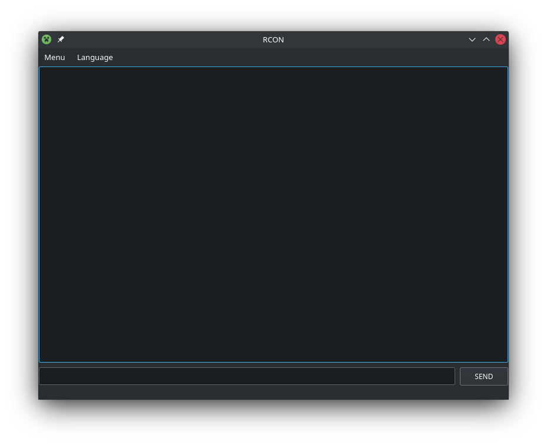

## Вступление
- [О программе URCON](#О-программе-URCON)
- [Релизы](#Релизы)
- [Запуск из исходников](#Запуск-из-исходников)
- [Скриншоты](#Скриншоты)

## О программе URCON
Universal rcon client
Простой графический (GUI) rcon клиент для серверов Minecraft!
Проверен на серверах:
- Altay
- Nukkit
- Pocketmine

Эта программа использует модуль python https://github.com/conqp/rcon
#
## [Релизы](https://github.com/BlackCatDevel0per/URCON/releases)

## Запуск из исходников
Запуск из исходного кода с помощью python3 urcon.py

## Introduction
- [About URCON](#About-URCON)
- [Run from source](#Run-from-source)
- [Screenshots](#Скриншоты)

## About URCON
Simple GUI rcon client for Minecraft servers!

This program uses the python module https://github.com/conqp/rcon

## Run from source
Run from source with python3 urcon.py

# Скриншоты

