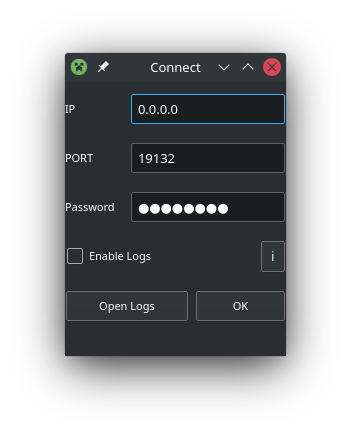

## Оглавление

[О программе URCON](#О-программе-URCON)
[Запуск из исходников](#Запуск-из-исходников)
[Скриншоты](#Скриншоты)

[About URCON](#About-URCON)
[Run from source](#Run-from-source)
[Screenshots](#Скриншоты)

# Скриншоты
____

____
## О программе URCON
Простой графический клиент rcon для серверов Minecraft!

Эта программа использует модуль python https://github.com/conqp/rcon

## Запуск из исходников
запуск из исходного кода с помощью python3 urcon.py

## About URCON
Simple GUI rcon client for Minecraft servers!

This program uses the python module https://github.com/conqp/rcon

## Run from source
run from source with python3 urcon.py
