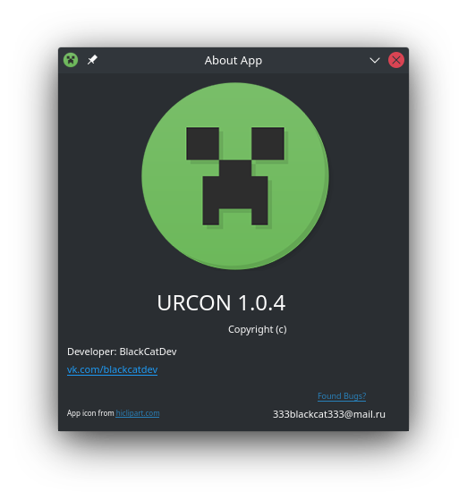

# URCON Русский
Простой графический клиент rcon для серверов Minecraft!

Эта программа использует модуль python https://github.com/conqp/rcon

запуск из исходного кода с помощью python3 urcon.py

# URCON English
Simple GUI rcon client for Minecraft servers!

This program uses the python module https://github.com/conqp/rcon

run from source with python3 urcon.py
